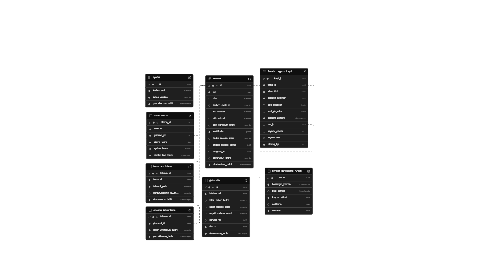

# KDS - Karar Destek Sistemi

Sabancı Vakfı Sürdürülebilirlik Karar Destek Sistemi, orta kademe yöneticiler için 6-12 aylık stratejik planlama aracıdır.

## Proje Amacı

Bu sistem, firma verilerini analiz ederek sürdürülebilirlik, geri dönüşüm ve girişimcilik performanslarını görselleştirir. Kullanıcılar DSS (Decision Support System) parametrelerini değiştirerek farklı senaryoları değerlendirebilir.

## Senaryo Açıklaması

Sistem aşağıdaki senaryoları destekler:

1. **Firma Bazlı KPI Analizi**: Seçilen firma için tahmini getiri ve kadın girişimci bütçesi hesaplanır.
2. **Sürdürülebilirlik Karşılaştırması**: En iyi 7 firmanın sürdürülebilirlik uyum puanları görüntülenir.
3. **Geri Dönüşüm Performansı**: En iyi 10 firmanın geri dönüşüm oranları analiz edilir.
4. **Girişimci Değerlendirmesi**: DSS parametrelerine göre girişimciler skorlanır ve sıralanır.

## Kurulum Adımları

### Gereksinimler

- Node.js 18 veya üzeri
- npm veya yarn
- Supabase hesabı ve veritabanı

### Kurulum

1. **Projeyi klonlayın:**
   ```bash
   git clone <repository-url>
   cd projekdsyagmur
   ```

2. **Bağımlılıkları yükleyin:**
   ```bash
   npm install
   ```

3. **Environment değişkenlerini ayarlayın:**
   ```bash
   cp .env.example .env
   ```
   
   `.env` dosyasını düzenleyin:
   ```
   PORT=3000
   SUPABASE_URL=<supabase_url>
   SUPABASE_ANON_KEY=<supabase_anon_key>
   ```

4. **Sunucuyu başlatın:**
   ```bash
   npm start
   ```

5. **Tarayıcıda açın:**
   ```
   http://localhost:3000
   ```

## API Endpoint Listesi

| Endpoint | Method | Açıklama |
|----------|--------|----------|
| `/api/health` | GET | Sağlık kontrolü |
| `/api/firms` | GET | Tüm firma listesi |
| `/api/dashboard/kpis` | GET | Firma bazlı KPI verileri |
| `/api/dashboard/kpis?firma_id=X` | GET | Belirli firma için KPI |
| `/api/dashboard/all-returns` | GET | Tüm firmaların getiri verileri |
| `/api/dashboard/sustainability-top7` | GET | En iyi 7 sürdürülebilirlik puanı |
| `/api/dashboard/recycling-top10` | GET | En iyi 10 geri dönüşüm oranı |
| `/api/dashboard/entrepreneur-top10` | GET | En iyi 10 girişimci skoru |

## İş Kuralları

### Kural 1: Geçersiz Firma ID Doğrulaması

- **Etkilenen Endpoint:** `/api/dashboard/kpis?firma_id=X`
- **Koşul:** `firma_id` parametresi sayı değilse veya 0'dan küçükse
- **HTTP Kodu:** `400 Bad Request`
- **Mesaj:** `"Geçersiz firma ID"`

### Kural 2: Firma Mevcut Değil Kontrolü

- **Etkilenen Endpoint:** `/api/dashboard/kpis?firma_id=X`
- **Koşul:** Veritabanında eşleşen firma yoksa
- **HTTP Kodu:** `404 Not Found`
- **Mesaj:** `"Firma bulunamadı"`

### Kural 3: Maksimum Para Limiti

- **Etkilenen Endpoint:** `/api/dashboard/kpis`, `/api/dashboard/all-returns`
- **Koşul:** `tahmini_getiri > 999.000.000 TL`
- **Davranış:** Değer 999.000.000 TL'ye sabitlenir

### Kural 4: DSS Parametre Doğrulama

- **Etkilenen Endpoint:** `/api/dashboard/entrepreneur-top10`
- **Koşul:** `ref_kadin`, `ref_engelli`, `ref_min_yil` parametreleri geçersizse
- **HTTP Kodu:** `400 Bad Request`
- **Mesaj:** `"Geçersiz DSS parametreleri"`

## Veritabanı Yapısı

### Tablolar

- **firmalar**: Firma bilgileri (id, ad, ciro, atik_miktari, geri_donusum_orani)
- **firma_tahminleme**: Tahminleme kayıtları (firma_id, tahmini_getiri, surdurulebilirlik_uyum_puani)
- **girisimciler**: Girişimci bilgileri (isletme_adi, kadin_calisan_orani, engelli_calisan_orani, kurulus_yili)
- **ayarlar**: Sistem ayarları (butce_yuzdesi, karbon_esik)

## Proje Yapısı

```
projekdsyagmur/
├── app.js                    # Giriş noktası
├── controllers/
│   └── controller.js         # Tüm controller fonksiyonları
├── db/
│   └── supabase_connect.js   # Veritabanı bağlantısı
├── middlewares/
│   ├── loggers/
│   │   └── log.js            # Request loglama
│   └── validations/
│       ├── errorHandler.js   # Hata yakalama
│       └── validation.js     # Input doğrulama
├── routers/
│   ├── index.js              # Ana router
│   └── routes.js             # Route tanımları
├── services/
│   ├── firmalarService.js
│   ├── kpiService.js
│   ├── surdurulebilirlikService.js
│   ├── geriDonusumService.js
│   └── girisimciService.js
├── utils/
│   ├── errors.js             # Özel hata sınıfları
│   └── formatting.js         # Yardımcı fonksiyonlar
├── public/
│   ├── index.html            # Ana sayfa
│   ├── css/style.css
│   └── js/main.js
├── docs/
│   └── er-diagram.png        # ER diyagramı
├── .env.example
├── .gitignore
├── package.json
└── README.md
```

## Teknolojiler

- **Backend:** Express.js 5.x
- **Veritabanı:** Supabase (PostgreSQL)
- **Frontend:** Vanilla JavaScript, TailwindCSS, Chart.js
- **Diğer:** dotenv, cors, body-parser

## Geliştirici

Sunucu Tabanlı Programlama Dersi 2026 projesi.

## Lisans

ISC
