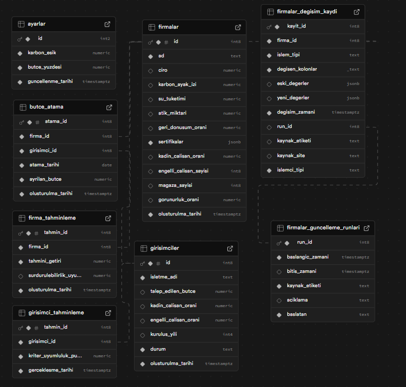

# KDS Proje 2 – Karar Destek Sistemi

## Proje Açıklaması

Bu proje, **Sunucu Tabanlı Programlama, Karar Destek Sistemleri ve Mekansal Veri tabanları** dersi kapsamında geliştirilmiş, MVC (Model–View–Controller) mimarisine uygun bir **RESTful API** uygulamasıdır. Uygulamanın temel amacı; Sabancı Vakfı orta düzey yöneticisi için, yöneticinin İzmir’de faaliyet gösteren tekstil firmalarından sürdürülebilirlik kriterlerine en uygun olan firmayla reklam iş birliği yapıp elde edilen geliri yine belirli kriterlere en çok uyan girişimci veya girişimcilere destekte bulunma kararına kritik değerlerle hazırlanmış özet tablolar ve interaktif grafiksel bir arayüzle destek olmak.

---

## Senaryo Tanımı

Uygulama, kurumsal bir yapıda kullanılan karar destek süreçlerini modelleyen bir senaryo üzerinden kurgulanmıştır. Sistem içerisinde kullanıcı belirli grafikler üzerinde  güncelleme, listeleme ve silme işlemlerini yapabilir. Bu işlemler sırasında gerçek hayatta karşılaşılabilecek kısıtlar iş kuralları olarak sisteme entegre edilmiştir.

Tanımlanan senaryo sayesinde; sunucu tarafında veri bütünlüğü korunmakta, geçersiz işlemler engellenmekte ve karar destek süreçleri kontrollü bir şekilde yürütülmektedir.

---

## Kurulum

Bu proje Node.js tabanlı bir sunucu uygulamasıdır.

### Gereksinimler

* Node.js (v18 veya üzeri)
* npm

### Kurulum Adımları

1. Projeyi klonlayın:

```bash
git clone https://github.com/yagmurrr083/kdsproje2.git
cd kdsproje2
```

2. Bağımlılıkları yükleyin:

```bash
npm install
```

3. Ortam değişkenlerini ayarlayın:

* Proje dizininde bulunan `.env.example` dosyasını kopyalayarak `.env` dosyasını oluşturun.

```bash
cp .env.example .env
```

* `.env` dosyası içerisine gerekli port ve veritabanı bağlantı bilgilerini girin.

4. Uygulamayı başlatın:

```bash
npm start
```

Uygulama varsayılan olarak aşağıdaki adres üzerinden çalışır:

```
http://localhost:PORT
```

`PORT` değeri `.env` dosyasında tanımlıdır.

---

## API Endpoint Listesi

| Endpoint         | Metod  | Açıklama                     |
| ---------------- | ------ | ---------------------------- |
| `/api/items`     | GET    | Kayıtları listeler           |
| `/api/items/:id` | GET    | Tekil kayıt detayını getirir |
| `/api/items`     | POST   | Yeni kayıt oluşturur         |
| `/api/items/:id` | PUT    | Kayıt günceller              |
| `/api/items/:id` | DELETE | Kayıt siler                  |

Endpointler REST prensiplerine uygun olarak tasarlanmış ve HTTP metodları doğru amaçlarla kullanılmıştır.

---

## İş Kuralları (Özel Senaryolar)

1. **Geçmiş Tarihli Kayıtların Silinememesi**
   Belirli bir tarihten sonra geçerliliğini yitirmiş kayıtlar sistem tarafından silinemez. Bu kontrol sunucu tarafında yapılır ve geçersiz silme işlemleri engellenir.

HTTP Status: 409
Mesaj: Geçmiş tarihli kayıtlar silinemez

2. **Geçersiz Veri Girişinin Engellenmesi**
   Belirlenen kurallara uymayan veri girişleri (eksik alan, hatalı değer vb.) sistem tarafından reddedilir ve istemciye anlamlı hata mesajları döndürülür.

HTTP Status: 400
Mesaj: Geçersiz veri girişi

---

## ER Diyagramı
Aşağıda, uygulamada kullanılan veritabanı yapısını gösteren ER diyagramı yer almaktadır.


---

## Ortam Değişkenleri

Projede kullanılan ortam değişkenleri `.env.example` dosyasında tanımlanmıştır. Güvenlik sebebiyle gerçek ortam değişkenlerini içeren `.env` dosyası repoya eklenmemiştir.
